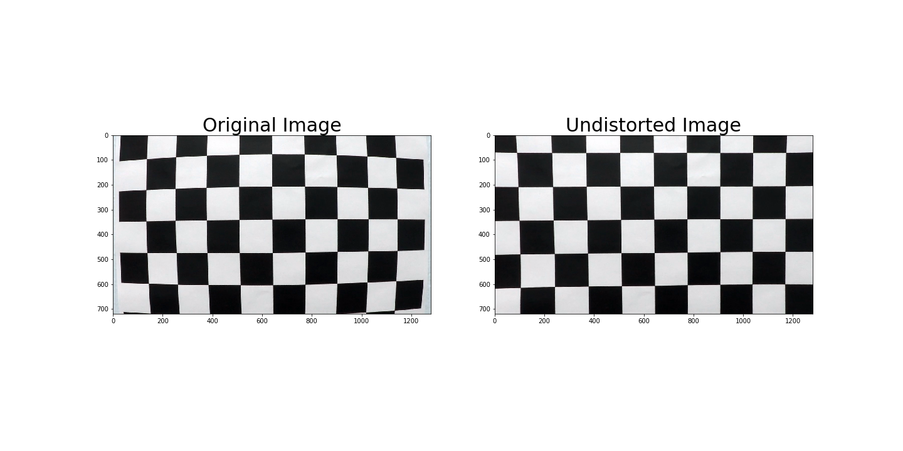
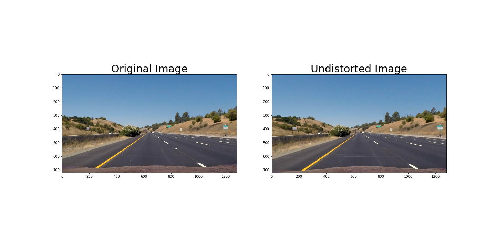
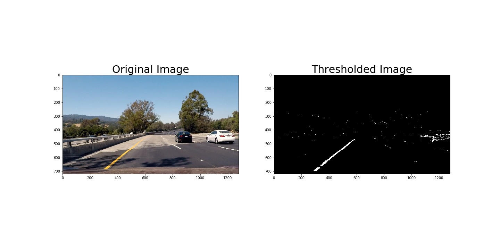
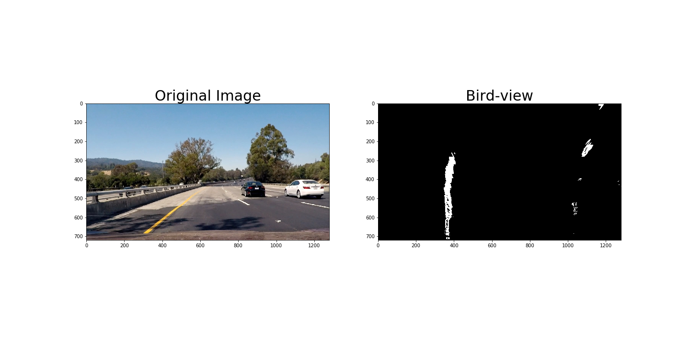
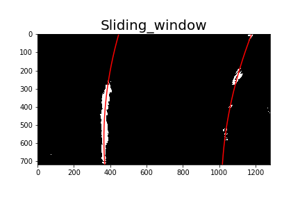
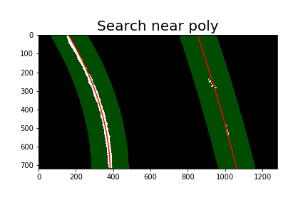
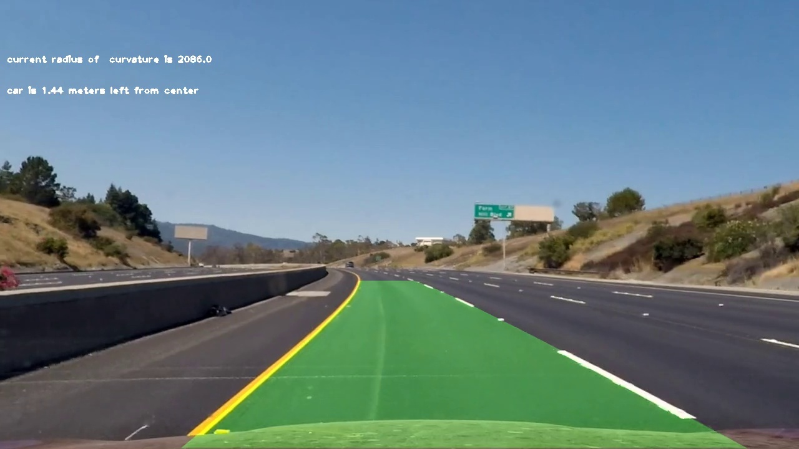

## Advanced Lane Finding

In this project my goal was to write a software pipeline to indentify the lane boundaries in a video. 
First of all I calibrate the camera by using buil-in opencv camera calibration functions. Laterly I use some customised binary threshold function to highlight lines and use perspective transformation to bird-view. After this I use sliding window or searching near previously finded polyline to find position of the lane in image. After all of these I compute car position on the lane and lane curvature and visualise lane and its features on image. 

---

### Camera calibration

this stage is located under heading **camera calibration** in my "AdvancedLineFinding" ipython notebook.

Because of some defects in camera lenses there are geometrical distortion and we need to correct them to use camera images to truly undestand forms of the real objects.

We use simply recogniseble patern as chessboard (regular secuenses of black and white squares) situated on a flat surface. We use 9x6 pattern. Take many pictures of it and find chessboar couners of it by cv2.findChessboardCorners. As we assume that patter is on a flat surfate we know that all line should be strate. We use cv2.calibrateCamera function which retuns mtx and dist coefficiets which further used to undistort images by cv2.undistort function.

Here is the result of the camera calibration for the chessboard image.

---

### Pipeline (single images)

First of all undistort our real images.
Here is the example.

Later in section **finding threshold** I try different color spaces like rgb, hls and hsv to find out which is the best to highlight lines on image, also I try different  gradients as x, y, magnitude and directional.
Finaly I used combined threshold which consists of v channel from hsv, s channel from hsl and complex gradient threshold (**final threshold** section)

Here is the result of my threshold function.

In section **perspective transform** I use transformation image to bird-view because only in this view we can accurately measure curvature of the lane without distortions from ourpoint of view.
Here is the result of my pespective transform.

There are 2 lane finding algirithm in **find line** section. 
Frist algo is sliding window, it is used on a start of find line process or if we lost our line under some circumstanses as dramaticaly litening or color changes.  First point of the algorithm is histogram of the bottom half of the binary image, there we can find 2 peaks - these are starting points of our lines. After we go up and searching for continuing of the line in some margin near the center of the previous window and continuous the process to the top of the image.

Here is the image of the lines founded by the slinding function.
{ float: right; }

The second one is searching near poly line from the previous image. It takes some poly line and search for the activated pixels on bin image in some area near the poly line. 
Here is the image of the lines founded by the search near poly.

After finding points of the left and right lines on image I use np.polyfit to find polynominal coefficents of the curv that aproximates the line.

In section **measure curvature and car position** I calculate line curvature by using poly coefficents of the line and bottom pixels by y axis and also I use conversion from pixels to metes. Car position is estimted by findig center of the car as the center of the image, and the center of the lane as the mean of the starting points of the left and right lines. As we known these number we can find car position by substraction one from another.

The full pipeline for video processing is situated in **make pipeline** section. There I use Line() class to store the information about left and right lines separately and there I can track changes of the lines parameters as the x, y of the line points, polylines, poly coefficients, was_detected and so one. 

Here is a result of my pipeline:

---

### Pipeline (video)

In section **video processing** I pass all frames of project_video file throw my pipeline to get the final video of the project.
Here is a [link to my video result](./project_output.mp4)

---

### Discussion

The main challenges for me in this project were in trying processing challenge videos, first of all I take images from challenge video, after this I tried to find suitable tresholds for different color spaces but I can not find them, the images were very gray or very white. The one thing I had found is that gradients on such images work better than on images in good lighting condtion. But I did not include gradient as an independent channel in my finat threshold because of that in project video pefomance significantly decrease and lines were found there them should not be. 

I think that using a some different pipelines for various lighting condition which can be switched will impruve the results. 
